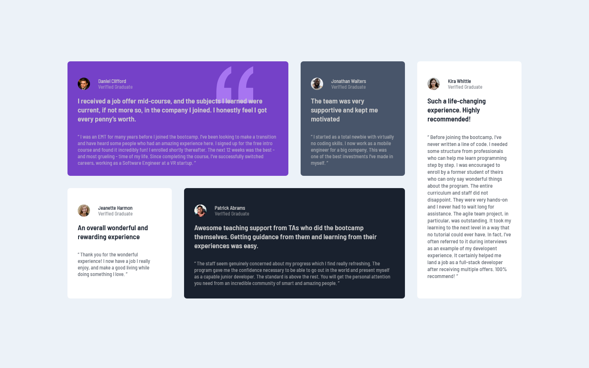
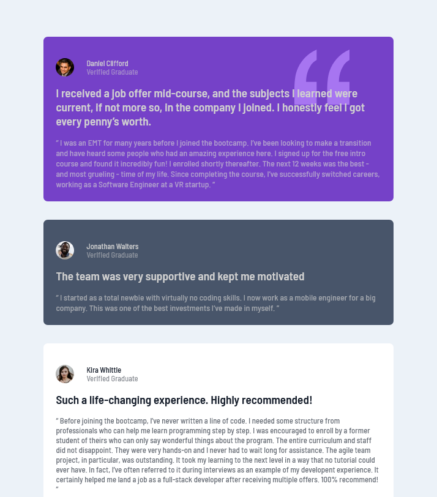
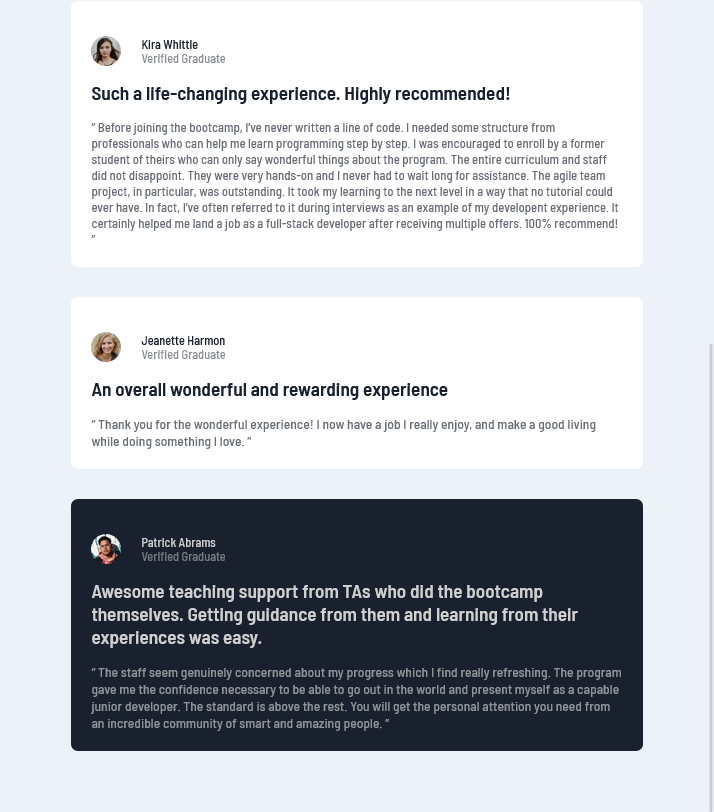

# Frontend Mentor - Testimonials grid section solution

This is a solution to the [Testimonials grid section challenge on Frontend Mentor](https://www.frontendmentor.io/challenges/testimonials-grid-section-Nnw6J7Un7). Frontend Mentor challenges help you improve your coding skills by building realistic projects. 

## Table of contents

- [Overview](#overview)
  - [The challenge](#the-challenge)
  - [Screenshot](#screenshot)
  - [Links](#links)
- [My process](#my-process)
  - [Built with](#built-with)
  - [What I learned](#what-i-learned)
  - [Continued development](#continued-development)
  - [Useful resources](#useful-resources)
- [Author](#author)
- 

## Overview
I built a testimonial-grid from frontendmentor. 


### The challenge

Users should be able to:

- View the optimal layout for the site depending on their device's screen size

### Screenshot








### Links

- Solution URL: [Add solution URL here](https://your-solution-url.com)
- Live Site URL: [Add live site URL here](https://your-live-site-url.com)

## My process
I started with HTML then CSS.

I used css grid to align before styling.

finally after the styling comes the finishing touches, which takes time!!

I did desktop design before mobile.


### Built with

- Semantic HTML5 markup
- CSS custom properties
- Flexbox
- CSS Grid


### What I learned

I learned how to use css grid grid area, I am getting better at responsive designs.


```css
 {
  
  grid-template-areas:
    "daniel daniel jonathan kira"
    "jeannette patrick patrick kira";
}

```


### Continued development


I need wasnt able to fixed the quotation marks to its parent element and push it behind the p element.
i tried using margin but it makes the div contents it is not resposive. i settles with margin. 4hrs of hw same thing.
 chrome and firefox windows zoom is different with my design being perfect in firefoz and bad in chrome.!


I definetly need to practice using css grid more and css flexbox. I need work on responsive design and accessibilty too.


### Useful resources

- [Free-code-camp](https://www.example.com) - I had review the css grid lesson on legacy web design.

- [WW3-schools] (https://www.ww3.com) - for cheking things i forgot.


## Author

- Frontend Mentor - [@hafsatun2020](https://www.frontendmentor.io/profile/hafsatun2020)

